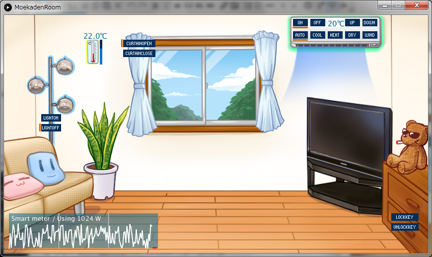

[English](README.md)
# MoekadenRoom - An ECHONET Lite Emulator
エアコン、照明、電動ブラインド、電子錠、温度計、スマートメーターの合計６種類の機器オブジェクトが含まれています。
Processingで作られています。

## Updates
2020/12/24 [moscow4ghさん](https://github.com/moscow4gh)によるスマートメーターのバグフィックスを適用。 
2017/9/20 ControlP5はWindowsやLinuxで動かした際にもOutdatedだったので、いっそのこと[misc/RequiredLibs.zip](https://github.com/SonyCSL/MoekadenRoom/blob/master/misc/RequiredLibs.zip?raw=true)に入れました。Mac版の特別な説明を削除しました。 
2017/9/6 zipの中身が古かったのでexportし直しました。あと_f_Back/も全zipに追加しました。Mac向け解説をREADMEに追加しました。[@ikesato](https://github.com/ikesato)さんありがとうございます！ 
2016/12/5 スマートメーターの実装をちょっとだけよくしたのと瞬時値・履歴データを画面に表示するようにしました。   
2016/12/2 Processing3に対応しました。<a href="https://github.com/issekiamp" target="_blank">一石アンプさん</a>ありがとうございます！ 
2015/12/25 適当ですがスマートメーターオブジェクトを加えました。 

# Download executables
以下からお好きなものを落として使ってください。Win32以外はJavaが必要だと思います。また、Processing IDEから実行するにはlibrariesフォルダ内にOpenECHO for ProcessingとControlP5が必要です。一応[固めておきました](https://github.com/SonyCSL/MoekadenRoom/blob/master/misc/RequiredLibs.zip?raw=true)。
Linux版はMoekadenRoomというファイルに実行属性をつけて走らせるとよいと思います。

+ <a href="misc/application.windows64.zip?raw=true" target="_blank">Win64+Java Runtime</a>
+ <a href="misc/application.windows32.zip?raw=true" target="_blank">Win32</a>
+ <a href="misc/application.linux-arm64.zip?raw=true" target="_blank">Linux arm64</a>
+ <a href="misc/application.linux-armv6hf.zip?raw=true" target="_blank">Linux armv6hf</a>
+ <a href="misc/application.linux64.zip?raw=true" target="_blank">Linux64</a>
+ <a href="misc/application.linux32.zip?raw=true" target="_blank">Linux32</a>

※Macはエクスポートできなかったので、Processing IDEから実行してください。  
※ソースコードのライセンスは<a href="http://sourceforge.jp/projects/opensource/wiki/licenses%2FMIT_license" target="_blank">MITライセンス</a>にします。ただし、画像はそのまま二次利用しないでください。  
※中で使っている<a href="https://github.com/SonyCSL/OpenECHO" title="OpenECHO site" target="_blank">OpenECHO</a>もMITです。<a href="http://www.sojamo.de/libraries/controlP5/" title="Control P5 page" target="_blank">ControlP5</a>はLGPLです。

# 使用方法
+ このアプリは2種類の入力を受け付けます。1. ECHONET Liteネットワークからの入力、2. ユーザーのマウスによる入力です。
+ 温度センサーについては、本来外部入力によりその値を変更することはできませんが、エミュレータなので、ユーザーがマウスで温度計の右にあるスライダを動かすと値を変更できるようにしました。
+ 本プログラムが走っているのにECHONET Liteネットワークから機器オブジェクトが見えない場合、ウィルス対策ソフトやファイアーウォールが悪さをしているかもしれません。ECHONET LiteはUDPのポートを開けて使いますのでそれを防がれてしまうと通信できません。トラブルの時はファイアーウォールを切る必要があるかもしれません。ただし、もちろんその間は外部からの攻撃に対して脆弱になりますので、自己責任でお願いします。
+ １つのPCで２つ以上立ち上げてはいけません。本エミュレータは「ノード」を一つ作り、その中に機器オブジェクトを4つ入れるようになっています。IPv4で実装されたECHONET Liteでは、一つのIPアドレスに対してノードは１つでないといけないという制約があります。1つのPCで二つエミュレータを立ち上げると、ノードが2つになってしまうわけです。
+ 萌家電の背景画像を使っただけなので、萌えキャラは出てきません

# 主な実装済みオブジェクト・プロパティ
<table>
<tr>
<th>オブジェクト名(EOJ)</th>
<th>プロパティ(EPC)</th>
<th>Values(EDT) (太字は初期値)</th>
</tr>
<tr>
<td rowspan=3>Home Air Conditioner 0x0130</td>
<td>電源 0x80</td>
<td><b>[0x31]:Off</b> [0x30]:On</td>
</tr>
<tr>
<td>動作モード 0xb0</td>
<td>[0x41]:Auto <b>[0x42]:Cool</b> [0x43]:Heat [0x44]:Dry [0x45]:Wind</td>
</tr>
<tr>
<td>設定温度 0xb3</td>
<td>1byteで符号付設定温度。 <b>Default=[20](=20℃)</b></td>
</tr>
<tr>
<td>照明オブジェクト 0x0290</td>
<td>電源 0x80</td>
<td><b>[0x31]:Off</b> [0x30]:On</td>
</tr>
<tr>
<td>電動ブラインドオブジェクト 0x0260</td>
<td>開閉状態 0xe0</td>
<td><b>[0x41]:Open</b> [0x42]:Close</td>
</tr>
<tr>
<td>電子錠オブジェクト 0x026F</td>
<td>施錠状態 0xe0</td>
<td><b>[0x41]:Locked</b> [0x42]:Unlocked</td>
</tr>
<tr>
<td>温度計オブジェクト 0x0011</td>
<td>温度 0xe0</td>
<td>Big endian 2byteで 符号付温度を0.1℃ 単位で表す <b>(Default [0,220]  = 22.0℃)</b></td>
</tr>
<tr>
<td rowspan=8>スマートメーターオブジェクト 0x0288</td>
<td>履歴有効桁数 0xd7</td>
<td>1～8:<b>[8]</b> 正直言って、守っていない。</td>
</tr>
<tr>
<td>積算電力量kWh 0xe0</td>
<td>現在は30分間隔サンプルの最新値を返す</td>
</tr>
<tr>
<td>積算電力量の単位 0xe1</td>
<td>0x0～0x0D. <b>[0x02]:0.01kWh</b></td>
</tr>
<tr>
<td>積算電力履歴(正方向) 0xe2</td>
<td>1～2 バイト目：収集日 0x0000～0x0063(0～99) 3 バイト目以降：積算電力量計測値 (4byteづつ48サンプル。Big Endian。 データがないところは0xFFFFFFFEが返る)</td>
</tr>
<tr>
<td>積算履歴収集日 0xe5</td>
<td>0:当日 1～99:前日の日数 <b>[0]:当日</b></td>
</tr>
<tr>
<td>瞬時電力計測値 0xe7</td>
<td>Watt単位。4 bytes <b>ランダム値</b></td>
</tr>
<tr>
<td>瞬時電流計測値 0xea</td>
<td>0.1A単位。2byteづつR相・T相。 <b>[瞬時電力を100で割ったもの]</b></td>
</tr>
<tr>
<td>30分毎の最新積算電力量(正方向) 0xea</td>
<td>計測年月日(4bytes) YYYY:MM:DD 計測時刻(3bytes) hh:mm:ss 積算電力量(4bytes)</td>
</tr>
</table>

※スマートメーターは、瞬時位置も履歴もランダムな値を生成して返します。エアコンか照明をつけたり消したりするとそれぞれ300W,100Wくらい変化するようにしてみました。ただし、瞬時値をどういじっても、履歴データは完全ランダムに追加されていきますので悪しからず。もし返答される値を好きに設定したい場合は、SoftElectricEnergyMeterクラスの最後のほうにあるgetInstantaneousEnergy()やgetCumlativeEnergy()を変更してください。

# Contributors
[Shigeru Owada](https://github.com/sowd)  
[Fumiaki Tokuhisa](https://github.com/tokuhisa)  
[Issekiamp san](https://github.com/issekiamp)  
[ikesato san](https://github.com/ikesato)  
