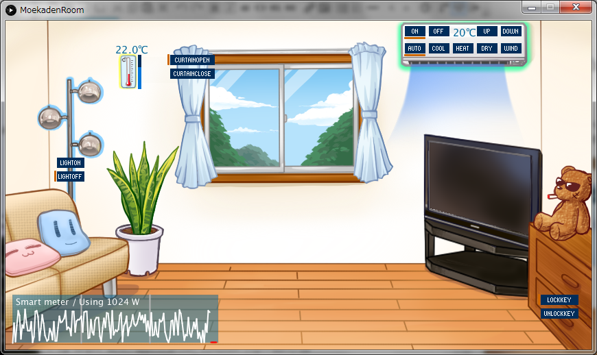

[Japanese README](README.jp.md)
# MoekadenRoom - An ECHONET Lite Emulator
It contains 6 kinds of home equipments: air conditioner, lighting, electric blinds, electronic lock, thermometer, smart meter. It is made with Processing.

# Download executables
Please download the desired version from the links below. Java runtime is necessary except Win32 ver. To execute in Processing IDE, you need two libraries: <a href="https://github.com/SonyCSL/OpenECHO" title="OpenECHO site" target="_blank">OpenECHO for Processing</a> and ControlP5. Put [those](https://github.com/SonyCSL/MoekadenRoom/blob/master/misc/RequiredLibs.zip?raw=true) in the **libraries** folder. For the Linux version, set runnable permission to the file named MoekadenRoom.

+ <a href="misc/application.windows64.zip?raw=true" target="_blank">Win64+Java Runtime</a>
+ <a href="misc/application.windows32.zip?raw=true" target="_blank">Win32</a>
+ <a href="misc/application.linux-arm64.zip?raw=true" target="_blank">Linux arm64</a>
+ <a href="misc/application.linux-armv6hf.zip?raw=true" target="_blank">Linux armv6hf</a>
+ <a href="misc/application.linux64.zip?raw=true" target="_blank">Linux64</a>
+ <a href="misc/application.linux32.zip?raw=true" target="_blank">Linux32</a>

 * I could not export for Mac. Please execute in Processing IDE.
*  The license of the source code is <a href="http://sourceforge.jp/projects/opensource/wiki/licenses%2FMIT_license" target="_blank">MIT</a>. 
* Do not use the image resources for other purposes.
* <a href="https://github.com/SonyCSL/OpenECHO" title="OpenECHO site" target="_blank">OpenECHO</a> is also MIT. <a href="http://www.sojamo.de/libraries/controlP5/" title="Control P5 page" target="_blank">ControlP5</a> is LGPL.

# Usage
+ This application accepts two kinds of input. 1. from ECHONET Lite protocol, 2. User's mouse input through GUI.
+ According to the ECHONET Lite spec, temperature sensor value should not be changed by external input, but for convenience, we made it possible by moving the slider located right of the thermometer.
+ If you can not see the device objects through ECHONET Lite, antivirus software or the firewall may be blocking the packets. ECHONET Lite uses UDP 3610 port.
+ Do not boot more than one emulators on one PC.

# Implemented objects/ important properties
<table>
<tr>
<th>Object name (EOJ)</th>
<th>Property (EPC)</th>
<th>Values(EDT) (Boldface is the initial value)</th>
</tr>
<tr>
<td rowspan=3>Home Air Conditioner 0x0130</td>
<td>Power 0x80</td>
<td><b>[0x31]:Off</b> [0x30]:On</td>
</tr>
<tr>
<td>Operating mode 0xb0</td>
<td>[0x41]:Auto <b>[0x42]:Cool</b> [0x43]:Heat [0x44]:Dry [0x45]:Wind</td>
</tr>
<tr>
<td>Temperature setting 0xb3</td>
<td><b>[20](=20 degree)</b></td>
</tr>
<tr>
<td>Lighting 0x0290</td>
<td>Power 0x80</td>
<td><b>[0x31]:Off</b> [0x30]:On</td>
</tr>
<tr>
<td>Electric blind 0x0260</td>
<td>Open/Close 0xe0</td>
<td><b>[0x41]:Open</b> [0x42]:Close</td>
</tr>
<tr>
<td>Electronic lock 0x026F</td>
<td>State 0xe0</td>
<td><b>[0x41]:Locked</b> [0x42]:Unlocked</td>
</tr>
<tr>
<td>Thermometer 0x0011</td>
<td>Temperature 0xe0</td>
<td>Signed temperature in Celsius as big endian 2bytes (Unit=0.1C) <b>[0,220] (= 22.0C)</b></td>
</tr>
<tr>
<td rowspan=8>Smart meter 0x0288</td>
<td>Number of effective digits 0xd7</td>
<td>1～8:<b>[8]</b> Don't trust the emulator value ^^;</td>
</tr>
<tr>
<td>Cumulative electric energykWh 0xe0</td>
<td>Currently return the latest value of 30 minute interval sample</td>
</tr>
<tr>
<td>Unit of integrated electric energy 0xe1</td>
<td>0x0～0x0D. <b>[0x02]:0.01kWh</b></td>
</tr>
<tr>
<td>Integrated power history (forward direction)  0xe2</td>
<td>1st and 2nd byte: Collection date 0x0000 to 0x0063 (0 to 99) 
3 rd bytes or later: Integrated electric energy measurement value 
(48 samples in 4 bytes.Big Endian. 
0xFFFFFFFE is returned where there is no data)</td>
</tr>
<tr>
<td>Accumulation history collection date  0xe5</td>
<td>0:Today 1～99:Past days <b>[0]:Today</b></td>
</tr>
<tr>
<td>Instantaneous power measurement value  0xe7</td>
<td>Unit = Watt. 4 bytes <b>Random</b></td>
</tr>
<tr>
<td>Instantaneous current measurement value  0xea</td>
<td>Unit=0.1A.2 bytes for R phase, T phase each <b>[Instantaneous power measurement value/100]</b></td>
</tr>
<!-- tr>
<td>The latest accumulated electric energy (positive direction) every 30 minutes  0xea</td>
<td>計測年月日(4bytes) YYYY:MM:DD 計測時刻(3bytes) hh:mm:ss 積算電力量(4bytes)</td>
</tr -->
</table>

* The smart meter will generate and return random values for instantaneous power and history. When turning on / off the air conditioner or lighting it rises about 300W, 100W respectively. However, no matter how you modify the instantaneous value, historical data will be completely randomly added. If you want to set a specific value, call getInstantaneousEnergy () or getCumlativeEnergy () at the end of the SoftElectricEnergyMeter class.

# Contributors
[Shigeru Owada](https://github.com/sowd)  
[Fumiaki Tokuhisa](https://github.com/tokuhisa)  
[Issekiamp san](https://github.com/issekiamp)  
[ikesato san](https://github.com/ikesato)  
[moscow4gh san](https://github.com/moscow4gh)  

## Updates
2020/12/24 [moscow4ghさん](https://github.com/moscow4gh)によるスマートメーターのバグフィックスを適用。 
2017/9/20 ControlP5はWindowsやLinuxで動かした際にもOutdatedだったので、いっそのこと[misc/RequiredLibs.zip](https://github.com/SonyCSL/MoekadenRoom/blob/master/misc/RequiredLibs.zip?raw=true)に入れました。Mac版の特別な説明を削除しました。 
2017/9/6 zipの中身が古かったのでexportし直しました。あと_f_Back/も全zipに追加しました。Mac向け解説をREADMEに追加しました。[@ikesato](https://github.com/ikesato)さんありがとうございます！ 
2016/12/5 スマートメーターの実装をちょっとだけよくしたのと瞬時値・履歴データを画面に表示するようにしました。   
2016/12/2 Processing3に対応しました。<a href="https://github.com/issekiamp" target="_blank">一石アンプさん</a>ありがとうございます！ 
2015/12/25 適当ですがスマートメーターオブジェクトを加えました。 

